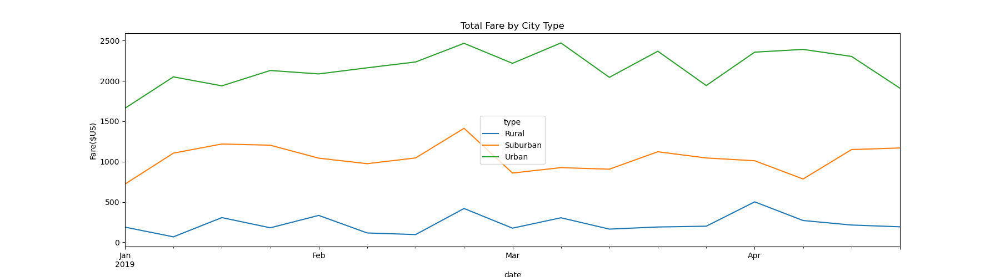

# PyBer_Analysis

# Overview of Project
In this module, we were tasked with conducting an exploratory analysis on a couple of very large CSV files for a company called Pyber, a Python-based ridesharing app company.

## *Purpose*
The purpose of this project was to create a summary DataFrame of the ride-sharing data by city type and a multiple-line graph showing the total weekly fares for each city type

# Results
## *Ride-Sharing DataFrame by City Type*
To create a new DataFrame, the provided csv files were loaded to jupyter notebook along with the dependencies.  From there, the two DataFrames were merged into a single dataset.  Doing some calculations, the total rides, total drivers, total amount of fares, the average fare per ride, and average fare per driver for each city type was obtained.  From there, a ride-sharing DataFrame by city type was generated.  Figure 1 shows the DataFrame and some code that will be discussed next.

### *Figure 1*

Part of the assignment was to format the columns to show the currency amounts in dollars.  I first thought about formatting individual columns and then realized that I could probably format the DataFrame as a whole.  Not knowing if this was possible, I conducted a quick only search.  

Fortunately, I found an article by Damien Martin that showed me how to do a "dictionary comprehension to generate a dictionary with defaults" and hence make the formatting less redundant.  I would like to share the link <https://kiwidamien.github.io/stylish-pandas.html> hoping it helps others as much as it has helped me.

Using a sample code found in the article, I was able to repurpose it to set ALL float columns to '${:,.2f}' as seen in Figure 1.  This is how the total fares, the average fare per ride, and the average fare per driver columns were formatted to a dollar value.

## *Total Weekly Fares per City Type*
For the second part of this challenge, both Pandas and Matplotlib were used to create a multiple-line graph that shows the total weekly fares for each city type, Figure 2.

### *Figure 2*

Figure 2 was creted by using the object-oriented interface and df.plot() methods along with the Matplotlib "fivethirtyeight" graph style code snippet provided in the starter code. 

Based on the graph, the weekly fares for the Urban area are higher, which indicates a correlation between population and total number of fares. This means that more money is generated where there is more people. 

# Summary
Overall, it is amazing how much we can learn from analyzing data. 
I would recommend for more months to be included in the data.  Also, to include data per year to do a year-to-year comparison if possible. 

# References
https://kiwidamien.github.io/stylish-pandas.html